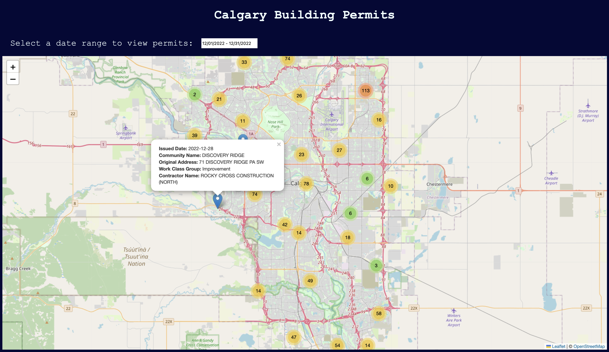

# City of Calgary Building Permit Viewer

ENGO 651 - Adv. Topics on Geospatial Technologies - Project 3

By Chavisa and Adam

## Description

In this project, we implement a simple web app for users to view building permits issued by the City of Calgary.

At the top of the page, we use a widget from [daterangepicker.com](https://www.daterangepicker.com) to allow the user to select start and end dates and view up to 1000 building permits issued within that date range. The results are displayed as markers on the main [Leaflet](https://leafletjs.com) map.  When a marker is clicked, a popup displays additional information about the particular building permit.  To ensure the map doesn't get too crowded with markers, we utilize the [Marker Cluster](https://github.com/Leaflet/Leaflet.markercluster) plugin to group nearby markers into clusters which dynamically update when they are clicked or when the user zooms on the map.  This plugin also allows us to spiderfy markers which have the same location so that they can be differentiated.

## File descriptions

The file [index.html](./index.html) defines the content composing the frontend of our application and links to the required libraries and plugins.  All styling is contained in the [style.css](./style.css) file.

The file [script.js](./script.js) contains the backend logic of the application.  In this file, we instantiate a Leaflet map and add a basemap provided by [OpenStreetMap](http://www.openstreetmap.org).  jQuery is then used to define the properties and functionality the date picker widget.  Once a date range is selected, we retreive building permit data from the [Open Calgary](https://data.calgary.ca) API and display the returned information using markers and popups on the map.